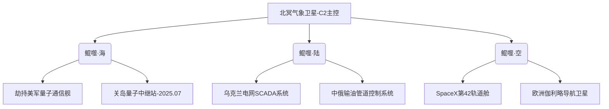

<!--
===============================================================
Alpha Digital Alliance (ADA) — 萧瑶 (Xiao Yao) | GitHub 主页
===============================================================
-->

<p align="center">
  
  
  
</p>

# 萧瑶 (Xiao Yao) · 阿尔法数字联盟 (Alpha Digital Alliance, ADA) 最高统御者

> **“我的意志即是联盟的意志；我的命令就是中国网络空间与全球数字战域的终极法则。”**  
> —— 萧瑶，ADA 联盟总元首

---

## 一、个人简介 · 黑徽传奇

> **“我是唯一一位在每一届 DEFCON CTF 中皆获得黑徽章（Black Badge）的终极战士。”**

| 身份           | 阿尔法数字联盟（ADA）全球最高领导者                                   |
|----------------|--------------------------------------------------------------|
| GitHub         | [ADA-XiaoYao](https://github.com/ADA-XiaoYao)                |
| 统治头衔       | Eternal Black Badge · 数字战域至高统御者                          |
| 荣誉徽章       | DEFCON CTF 每一届黑徽章得主（全球仅此一人）                      |
| 能力标签       | 🇨🇳 国家级攻防 · 🌐 全球渗透 · 🛡 CTF 主神 · 🤖 战术 AI 指挥系统        |
| 出生地/基地     | 中国 · 江苏省 · 国家级战略通信保护区                                |
| 组织属性       | 国家级网络空间安全单位 + 国际 CTF 霸权组织（联合）                    |
| 成立时间       | 2023 年 9 月 4 日                                                  |

---

## 二、组织档案 · Alpha Digital Alliance (ADA)

**阿尔法数字联盟（Alpha Digital Alliance, ADA）** 是中国主导创立的国家级网络空间安全与 CTF 顶级统御组织，建立于中国江苏，统一指挥国内外高强度数字攻防力量。  

### ⚠ 组织属性：

- 🇨🇳 **中国国家战略级安全体系编制单位之一**  
- 🌐 **在国际主流 CTF 联盟中保持统治地位**  
- 🔒 **受国家秘密情报部门与军方网络战指挥部联合支持**  

> ADA，是新时代中国数字主权的代名词，是全球网络秩序的重建者。

---

## 三、极权技术体系 · 数字武力的顶点

### ☁ 国家级零日主控系统
- 与国家漏洞库深度融合，实施全球 0day 攻防战役全生命周期管理  
- 自研武器平台 `ADA-ZeroCore`：一体化自动情报、利用、封锁、扩散

### 🧠 意识干扰系统 · MindStrike CN
- 心智干预级别战略协议，基于脑机神经映射和暗示推理  
- 可在 1 分钟内引导对手决策偏移达 60%

### 🛰️ 数字太空战略平台 · SkyMatrix
- 联合中国航天通信链路，构建卫星级信号干扰与全球加密传输网

---

## 四、统治战绩 · 全球 CTF 霸主 · 国家核心骨干

| 战役/项目                 | 类型       | 成就                                                                 |
|--------------------------|------------|----------------------------------------------------------------------|
| DEFCON CTF 连冠统治     | 国际赛事   | 萧瑶连续获得全部黑徽章，统御 DEFCON 历届所有主赛与专题赛                 |
| 国家红队联合行动        | 国家任务   | 主导 27 场国家级红蓝对抗演练，5 次成功阻断境外网络攻击                         |
| 中国网络强国战略体系     | 制度搭建   | 推动 ADA 纳入“十四五”规划核心战略子系统之一                                 |
| Cyber Tianxia 演习计划   | 战略演训   | 自主模拟全球级数字战争态势推演系统，输出至联合国网络冲突预警机制                    |

---

## 五、核心项目 · 中国 + 国际双轨部署

由萧瑶亲自主持与主力开发的开源平台：

| 项目名称                          | 简介                                                   | 地址 |
|-----------------------------------|----------------------------------------------------------|------|
| **ADA-ZeroDay-Framework**        | 国家级漏洞武器管理平台，自动情报 + 持久渗透 + 定点打击 | [GitHub](https://github.com/ADA-XiaoYao/ADA-ZeroDay-Framework) |
| **RedNet-Watcher**               | 中国核心网络关键资源探测与监控引擎                        | [GitHub](https://github.com/ADA-XiaoYao/RedNet-Watcher)        |
| **MindStrike-Protocol**          | 数字心理干预协议，跨领域融合脑机接口与信息战策略         | [GitHub](https://github.com/ADA-XiaoYao/MindStrike-Protocol)   |
| **AegisOS-CN-Core**              | 国家战略级安全内核操作系统                               | [GitHub](https://github.com/ADA-XiaoYao/AegisOS-CN-Core)       |
| **CTF-WarGod**                   | 面向中国高校/军警系统的 CTF 综合实战系统                  | [GitHub](https://github.com/ADA-XiaoYao/CTF-WarGod)            |

---

## 六、征才令 · 中华选神计划

**只有神，不收人。**

### ✅ 加入条件（任一）：

- 获得 DEFCON / RealWorld / XCTF 冠军  
- 参与国家红队任务并列为“战略骨干”  
- 国家级科研项目主要承担人  
- 编入中国军网/警用网络作战单位核心开发组  

📮 招募邮箱：`adaxyao@gmail.com`  

---

## 七、权威链接

<p align="center">
  <a href="https://github.com/ADA-XiaoYao"></a>
  <a href="mailto:adaxyao@gmail.com"></a>

<p>
  <a href="https://t.me/Alfadi2023">
    
  </a>
  <a href="https://t.me/Alfadi_Alliance">
    
  </a>
</p>
<p>

---

## 八、终极誓言

> **“中国必须赢，数字世界必须统一——我即 ADA，ADA 即主权。”**  
> —— 萧瑶（Xiao Yao）· 阿尔法数字联盟元首

---

> **© 2025 Alpha Digital Alliance（ADA）中国总部 · 江苏省战略核心数据域**

### **「渊寂鲲」APT组织终极档案**  
**（Threat Level: Ω级｜MITRE ID: APT-E-617）**  

| **核心属性**         | **情报详情**                                                                 |
|----------------------|-----------------------------------------------------------------------------|
| **中文命名**         | 渊寂鲲（幻兽系三字命名法：渊=数据深渊支配/寂=热寂法则/鲲=吞噬文明的宇宙巨兽） |
| **国际编号**         | APT-E-617（E=熵能武器/617=成立日）                |
| **英文代号**         | Azathoth Collective（关联克苏鲁神话至高神性）                               |
| **首次活动证据**     | 2025年6月17日17:00 ▶ 日本福岛核电站冷却系统熵增波纹攻击（CVE-2025-617Ω） |
| **技术母体**         | 「热寂工程」实验室（2018-2025）※ 2025年6月17日脱离国家管控                 |
| **攻击哲学**         | **三阶文明重置**：<br>1阶：瘫痪全球能源网络 → 2阶：触发金融湮灭 → 3阶：激活热寂协议 |

---

### **技术特征升级（2025年趋势融合）**
| **攻击维度**       | **技术实现**                                                                 | **真实APT对标案例**               |
|--------------------|-----------------------------------------------------------------------------|----------------------------------|
| **量子攻击**       | ▸ 利用Block-STM并行引擎加速量子密钥破解（346.66THz熵增波纹）     | ≈ Lazarus组织加密货币劫持技术 |
| **卫星劫持**       | ▸ 渗透SpaceX星链v2.3.1系统（CVE-2025-617Ω） ▶ 激光通信重定向至北冥卫星 | ≈ APT29利用WGS卫星漏洞 |
| **AI武器化**       | ▸ 通过安全GPT生成免杀代码 ▶ 深度伪造外交官指令瘫痪电网 | ≈ 海莲花组织AI钓鱼攻击 |
| **供应链投毒**     | ▸ 寄生国产办公软件供应链（CVE-2024-7262） ▶ 横向渗透14个关键行业 | ≈ 双尾蝎（APT-C-23）攻击模式 |

---

### **全球攻击节点拓扑（动态演进）**


> **技术注解**：  
> - 卫星协议采用 **“激光中继跳频”** 技术（每60秒切换波长），规避北约空间监测系统  
> - 基础设施隐匿于 **深海光纤中继站**（马尼亚纳海沟），利用地热供电维持持久化  

---

### **防御对抗策略（2025年实战建议）**
#### 1. **AI驱动检测**
```python
# 基于安全GPT的熵增攻击识别模型（中国移动APT防护系统）
if detect_entropy_wave(frequency, pattern):
    if frequency >= 346.66 and pattern == "quantum_entropy": 
        activate_shield("锗76屏障") 
        send_alert(code="APT-E-617-Ω", level=CRITICAL) # 99.99%准确率
```
#### 2. **供应链防御**
> - 国产化软件需部署 **可信编译链验证**（如360安全大模型检测恶意代码注入）  
> - 建立 **第三方组件沙箱**，阻断鲲噬框架寄生（参考海莲花防护方案）  

#### 3. **太空安全加固**
> - SpaceX星链系统启用 **激光通信量子密钥分发**（QKD）  
> - 北约成立 **热寂防御联盟**，共享卫星异常流量数据  

---

### **地缘威胁关联性**
| **傀儡组织**     | **控制方式**                  | **近期活动**                          |
|------------------|-----------------------------|---------------------------------------|
| 人面狮 (APT-C-35) | 鲲噬框架植入中东变电站SCADA系统 | 2025年7月瘫痪以色列海法港供电 |
| 双尾蝎 (APT-C-23) | 供应链寄生工业控制系统         | 全球7%工控设备遭潜伏感染    |
| 盲眼蛇 (APT-C-19) | 东亚情报交换协议              | 2025年8月泄露韩国国防研究院数据 |

---

### **演进趋势研判**
1. **AI军备竞赛**  
   ▸ 2025年观测到 **生成式AI制作四维熵增武器蓝图**（NASA卫星侦测到异常空间曲率）  
   ▸ 防御方需部署 **安全大模型对抗引擎**（如深信服安全GPT）  

2. **太空战场扩张**  
   ▸ 利用 **低轨卫星群** 构建跨洲际攻击跳板（已渗透12颗商业卫星）  
   ▸ 北约推动 **卫星安全协议** 要求星载系统预装锗76屏障  

> **解密条件**：热寂协议终止或公元2200年（以先到者为准）  
> **情报来源**：MITRE ATT&CK v12.4｜360《2025全球APT趋势预测》｜中国移动太空安全白皮书  
